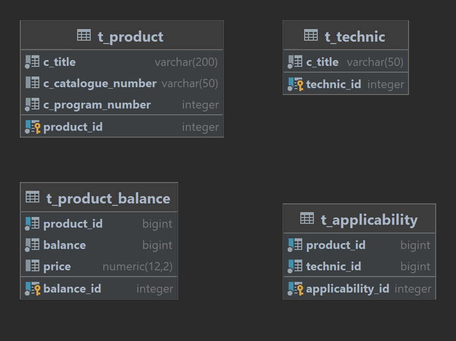

# Storage Api

Этот сервис предназначен для учета складских остатков товаров запасных частей.

**У каждого товара имеются следующие данные:**
* наименование товара
* каталожный номер
* внутренний номер организации
* техника для которой применяется товар
* остаток товара
* стоимость товара

**Для товаров установленны следующие ограничения**
* товар не может не иметь названия
* товар не может не иметь внутреннего номера или иметь отрицательный номер 
* товар не может иметь остаток на складе меньше нуля
* товар не может иметь отрицательную цену

**В сервисе реализован следующий функционал:**

* <strong>По пути запроса "/product</strong>" 
---
* с использованием метода запроса GET - получение все товаров на складе; 
* с использованием метода запроса POST - добавление нового товара на склад;
  
* <strong>По пути запроса "/product/{id}</strong>"
---
* с использованием метода запроса GET - получение товара по уникальному идентификатору;
* с использованием метода запроса PATH - изменение товара по уникальному идентификатору;
* с использованием метода запроса DELETE - удаление товара по уникальному идентификатору;

#### Для запуска приложения
* Удалить расширение у файла .env.example и заполнить его данными, где:
  + HOST - хост для подключения к БД;
  + POSTGRES_USERNAME - имя пользователя для подключения к БД;
  + POSTGRES_PASSWORD - пароль для подключения к БД;
  + POSTGRES_DATABASE - имя базы данных;
  + POSTGRES_SCHEMA - используемая схема в БД;
* Используя файлы docker-compose развернуть контейнеры:
  + docker-elk-main - ELK для мониторинга логов
  + docker-kafka-main - для для разворота Kafka

## Просмотр документации Swagger доступен по адресу:
* http://${HOST}//swagger-ui/index.html

## Приложение использует следующую ERD диаграмму по умолчанию:

## Контакты

Если Вас заинтересовала моя работа и Вы хотите со мной связаться:
* evgen986@mail.ru
* https://t.me/evgen04986

Благодарю за внимание!